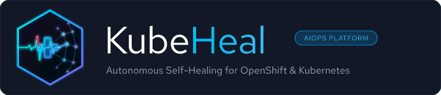

<p align="center">
  <picture>
    <source media="(prefers-color-scheme: dark)" srcset="assets/branding/png/kubeheal-logo-horizontal.png">
    <source media="(prefers-color-scheme: light)" srcset="assets/branding/png/kubeheal-logo-light.png">
    
  </picture>
</p>

# KubeHeal Operator

A Kubernetes operator for deploying and managing the [KubeHeal AIOps Self-Healing Platform](https://github.com/KubeHeal/openshift-aiops-platform) on OpenShift clusters.

## Overview

The KubeHeal Operator automates the deployment and lifecycle management of the KubeHeal self-healing platform. It wraps the platform's Helm chart into an OLM-compatible operator, enabling one-click installation from OperatorHub.

**What it deploys:**
- Coordination Engine (Go-based multi-layer remediation orchestrator)
- MCP Server (Model Context Protocol for AI assistant integration)
- ML model serving via KServe (anomaly detection + predictive analytics)
- Tekton pipelines for model training and validation
- Monitoring stack (Prometheus rules, Grafana dashboards, ServiceMonitors)
- Jupyter workbench for ML development
- DataScienceCluster CR (enables KServe and workbenches in RHOAI)
- S3 object storage integration (NooBaa/ODF or native AWS S3)

## Platform Compatibility

The operator uses the same topology-aware Helm chart as the [Validated Patterns deployment](https://github.com/KubeHeal/openshift-aiops-platform). Two CR values control all platform-specific behavior:

| Platform | `cluster.topology` | `objectStore.backend` | Storage Class | Support Tier |
|----------|--------------------|-----------------------|---------------|-------------|
| **ROSA Classic HA** | `"ha"` | `"aws-s3"` (default) | `gp3-csi` | Tier 1 -- Tested |
| **ROSA Single-Worker** | `"sno"` | `"aws-s3"` | `gp3-csi` | Tier 1 -- Tested |
| **AWS IPI** | `"ha"` | `"aws-s3"` or `"noobaa"` | `gp3-csi` or `ocs-storagecluster-cephfs` | Tier 2 -- Community |
| **Baremetal (IPI/ABI)** | `"ha"` | `"noobaa"` | `ocs-storagecluster-cephfs` | Tier 2 -- Community |
| **Baremetal + External S3** | `"ha"` | `"aws-s3"` | `ocs-storagecluster-cephfs` | Tier 2 -- Community |
| **SNO (non-ROSA)** | `"sno"` | `"noobaa"` | `gp3-csi` | Tier 2 -- Community |

> **Tier 1** is tested in CI by the maintainers. **Tier 2** is community-maintained -- the chart supports these platforms but testing is contributed. See `config/samples/` for ready-to-use CRs for each platform.

### Baremetal and Agent-Based Install

Baremetal clusters (installed via IPI-baremetal, Agent-Based Installer, or UPI) are fully supported through the `"noobaa"` storage backend, which uses ODF on local disks. Alternatively, if you have an external S3 service (MinIO, Ceph RADOS Gateway), set `objectStore.backend: "aws-s3"` with a custom `objectStore.aws.endpoint`.

See [`config/samples/aiops_v1alpha1_selfhealingplatform_baremetal.yaml`](config/samples/aiops_v1alpha1_selfhealingplatform_baremetal.yaml) for a complete example with both options.

## Quick Start

> **Full installation runbook**: [docs/runbooks/install-operator.md](docs/runbooks/install-operator.md)
> provides copy-pasteable commands, pre-flight checks, verification steps, rollback
> instructions, and a troubleshooting guide. The runbook was validated on ROSA OCP 4.22.15.

### From CatalogSource (Recommended)

```bash
# 1. Create namespace and catalog
oc create namespace kubeheal-system

cat <<'EOF' | oc apply -f -
apiVersion: operators.coreos.com/v1alpha1
kind: CatalogSource
metadata:
  name: kubeheal-operator-catalog
  namespace: openshift-marketplace
spec:
  sourceType: grpc
  image: quay.io/takinosh/kubeheal-operator-catalog:v0.1.7
  displayName: KubeHeal Operator
  publisher: KubeHeal Community
EOF

# 2. Install via OLM
cat <<'EOF' | oc apply -f -
apiVersion: operators.coreos.com/v1
kind: OperatorGroup
metadata:
  name: kubeheal-operator-group
  namespace: kubeheal-system
spec:
  targetNamespaces:
  - kubeheal-system
---
apiVersion: operators.coreos.com/v1alpha1
kind: Subscription
metadata:
  name: kubeheal-operator
  namespace: kubeheal-system
spec:
  channel: alpha
  name: kubeheal-operator
  source: kubeheal-operator-catalog
  sourceNamespace: openshift-marketplace
  installPlanApproval: Automatic
EOF

# 3. Wait for operator
oc get csv -n kubeheal-system --watch

# 4. Deploy the platform
oc apply -f config/samples/aiops_v1alpha1_selfhealingplatform.yaml
```

### From OperatorHub (Coming Soon)

1. Search for "KubeHeal" in OperatorHub
2. Click Install
3. Create a `SelfHealingPlatform` CR

### Manual Installation (Development)

```bash
# Build and push the operator image
make docker-build docker-push IMG=quay.io/takinosh/kubeheal-operator:v0.1.0

# Deploy the operator
make deploy IMG=quay.io/takinosh/kubeheal-operator:v0.1.0

# Create a SelfHealingPlatform instance
kubectl apply -f config/samples/aiops_v1alpha1_selfhealingplatform.yaml
```

### Using OLM Bundle

```bash
# Build and push the bundle
make bundle-build bundle-push

# Run the bundle
operator-sdk run bundle quay.io/takinosh/kubeheal-operator-bundle:v0.1.0
```

## Custom Resource

The operator manages a single CRD: `SelfHealingPlatform`

```yaml
apiVersion: aiops.kubeheal.io/v1alpha1
kind: SelfHealingPlatform
metadata:
  name: kubeheal
  namespace: self-healing-platform
spec:
  cluster:
    topology: "ha"    # "ha" or "sno"
    version: "4.22"   # OpenShift version
  coordinationEngine:
    enabled: true
    replicas: 1
  mcpServer:
    enabled: true
  modelServing:
    enabled: true
  dataScienceCluster:
    enabled: true     # Creates RHOAI DataScienceCluster CR
  monitoring:
    enabled: true
  notebooks:
    enabled: true
  features:
    aiml: true
```

### Sample CRs

| File | Platform | Description |
|------|----------|-------------|
| [`aiops_v1alpha1_selfhealingplatform.yaml`](config/samples/aiops_v1alpha1_selfhealingplatform.yaml) | ROSA / AWS HA | Default HA configuration with AWS S3 storage |
| [`aiops_v1alpha1_selfhealingplatform_sno.yaml`](config/samples/aiops_v1alpha1_selfhealingplatform_sno.yaml) | SNO | Single Node OpenShift with reduced resources |
| [`aiops_v1alpha1_selfhealingplatform_baremetal.yaml`](config/samples/aiops_v1alpha1_selfhealingplatform_baremetal.yaml) | Baremetal / ABI | ODF storage with external S3 alternative |

## Prerequisites

The following operators must be installed on your cluster before deploying:

| Operator | Required | Purpose |
|----------|----------|---------|
| Red Hat OpenShift AI (RHOAI) | Yes | ML platform, KServe |
| OpenShift Pipelines (Tekton) | Yes | CI/CD pipelines |
| OpenShift Data Foundation (ODF) | When `objectStore.backend: "noobaa"` | S3 object storage (baremetal, SNO) |
| NVIDIA GPU Operator | Optional | GPU workloads |

> **Note:** External Secrets Operator and Notebook Validator Operator are installed automatically by the chart via OLM Subscriptions. You do not need to pre-install them.

> **Note:** The chart creates a DataScienceCluster CR by default (`dataScienceCluster.enabled: true`). If you manage RHOAI configuration separately, set this to `false`.

## Supported OpenShift Versions

- OpenShift 4.20, 4.21, 4.22

## Development

```bash
# Build the operator image
make docker-build CONTAINER_TOOL=podman

# Run locally (outside cluster)
make install run

# Run tests
make test

# Generate OLM bundle
make bundle
```

## Architecture

```
kubeheal-operator
  └── watches SelfHealingPlatform CR
       └── reconciles Helm chart (helm-charts/self-healing-platform/)
            ├── DataScienceCluster (RHOAI configuration)
            ├── Coordination Engine (Deployment)
            ├── MCP Server (Deployment)
            ├── KServe InferenceServices
            ├── Tekton Pipelines + Tasks
            ├── Monitoring (ServiceMonitor, PrometheusRule)
            ├── Jupyter Workbench (Notebook CR)
            └── Storage (PVCs, ObjectBucketClaim or AWS S3)
```

## Chart Sync

The embedded Helm chart is synced from [`charts/hub/`](https://github.com/KubeHeal/openshift-aiops-platform/tree/main/charts/hub) in the main platform repo:

```bash
# From the openshift-aiops-platform repo
make sync-operator-chart SYNC_ARGS="--push"
```

## Related Repositories

| Repository | Purpose |
|------------|---------|
| [openshift-aiops-platform](https://github.com/KubeHeal/openshift-aiops-platform) | Platform Helm charts and deployment |
| [openshift-coordination-engine](https://github.com/KubeHeal/openshift-coordination-engine) | Go coordination engine |
| [openshift-cluster-health-mcp](https://github.com/KubeHeal/openshift-cluster-health-mcp) | MCP server for cluster health |
| [self-healing-workshop](https://github.com/KubeHeal/self-healing-workshop) | Workshop and training materials |

## License

Apache License 2.0 - see [LICENSE](LICENSE)
