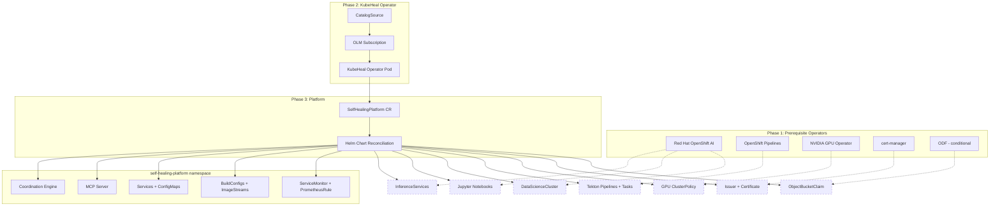

# Runbook: Full KubeHeal Platform Deployment

**Owner**: KubeHeal Community
**Risk Level**: Medium
**Last Updated**: 2026-10-02
**Last Tested**: 2026-10-02 (ROSA OCP 4.22.15)
**Version**: 1.0.0

---

## Quick Reference

| Attribute | Value |
|-----------|-------|
| **Execution Time** | ~45 minutes (operators install in parallel) |
| **Impact Window** | No downtime. Creates new namespaces only. |
| **Rollback Time** | ~10 minutes |
| **Prerequisites** | OpenShift 4.20+, `oc` CLI, cluster-admin |

---

## Scope and Use Case

### When to Use This Runbook

Use this runbook to deploy the complete KubeHeal AIOps Self-Healing Platform with
all prerequisite operators. After completion, every platform feature is active:
KServe model serving, Tekton training pipelines, Jupyter workbenches, GPU support,
and automated secrets management.

**Example Triggers**:
- Production deployment of the full platform on a new cluster
- Demo environment setup with all features enabled
- Post-upgrade re-deployment to verify all components

### Expected Outcome

After completion:
- Five prerequisite operators installed and healthy
- KubeHeal operator v0.1.7 running
- `SelfHealingPlatform` CR fully reconciled with all 18 CRD-gated resource types active
- Coordination Engine, MCP Server, KServe models, Tekton pipelines, and Jupyter workbench deployed
- Monitoring (ServiceMonitor, PrometheusRule) active

### What This Does NOT Cover

- ROSA cluster provisioning (see `scripts/create-rosa-cluster.sh`)
- S3 bucket creation or IAM credential configuration
- Model training execution or data pipeline runs
- Network policies or production TLS hardening

### Relationship to Other Runbooks

This runbook includes all steps from the
[operator-only install runbook](install-operator.md) and adds prerequisite operator
installation. If you only need the operator without prerequisites, use that runbook instead.

---

## Prerequisites

### Required Access and Permissions

- [ ] `cluster-admin` role on the target OpenShift cluster
- [ ] Network access from cluster to `quay.io` and `registry.redhat.io`
- [ ] For GPU: at least one node with an NVIDIA GPU (or a GPU machine pool on ROSA)

### Required Tools

- [ ] `oc` CLI 4.20 or later

**Verify tool installation**:

```bash
oc version --client
```

### Decide Your Configuration

Answer these questions before you start. Your answers determine which CR to apply in Step 8.

| Question | Options |
|----------|---------|
| **Cluster topology** | `ha` (multi-node) or `sno` (single node) |
| **Storage backend** | `aws-s3` (ROSA, AWS) or `noobaa` (baremetal, air-gapped) |
| **GPU enabled** | `true` (GPU nodes available) or `false` |
| **S3 bucket name** | Your bucket name (for `aws-s3`) or leave default (for `noobaa`) |

---

## Pre-Flight Checks

**STOP**: Do NOT proceed unless ALL checks pass.

### Check 1: Verify Cluster Access

```bash
oc whoami
oc get nodes
```

Pass criteria: Returns your username and lists cluster nodes.

If this fails: Run `oc login <cluster-api-url>` with valid credentials.

---

### Check 2: Verify OpenShift Version

```bash
oc version
```

Pass criteria: Server version is 4.20, 4.21, or 4.22.

---

### Check 3: Verify No Conflicting Installation

```bash
oc get csv -A 2>&1 | grep kubeheal
```

Pass criteria: No output.

If this fails: Run the [Rollback Procedure](#rollback-procedure) first.

---

### Check 4: Verify Worker Node Capacity

```bash
oc get nodes -l node-role.kubernetes.io/worker= \
  -o custom-columns=NAME:.metadata.name,CPU:.status.capacity.cpu,MEM:.status.capacity.memory
```

Pass criteria: At least 2 worker nodes with 8+ CPU and 32Gi+ memory each.

For SNO: At least 16 CPU and 64Gi memory on the single node.

---

## Step-by-Step Procedure

### Phase 1: Install Prerequisite Operators

All five operators install in parallel. Each creates its own namespace and CRDs.

#### Step 1: Install Red Hat OpenShift AI (RHOAI)

RHOAI provides KServe for model serving, Jupyter workbenches, and the DataScienceCluster API.

```bash
cat <<'EOF' | oc apply -f -
---
apiVersion: v1
kind: Namespace
metadata:
  name: redhat-ods-operator
---
apiVersion: operators.coreos.com/v1
kind: OperatorGroup
metadata:
  name: redhat-ods-operator
  namespace: redhat-ods-operator
spec: {}
---
apiVersion: operators.coreos.com/v1alpha1
kind: Subscription
metadata:
  name: rhods-operator
  namespace: redhat-ods-operator
spec:
  channel: stable-3.x
  name: rhods-operator
  source: redhat-operators
  sourceNamespace: openshift-marketplace
  installPlanApproval: Automatic
EOF
```

---

#### Step 2: Install Red Hat OpenShift Pipelines (Tekton)

Tekton provides Pipeline, Task, and PipelineRun CRDs for model training and deployment validation.

```bash
cat <<'EOF' | oc apply -f -
apiVersion: operators.coreos.com/v1alpha1
kind: Subscription
metadata:
  name: openshift-pipelines-operator
  namespace: openshift-operators
spec:
  channel: latest
  name: openshift-pipelines-operator-rh
  source: redhat-operators
  sourceNamespace: openshift-marketplace
  installPlanApproval: Automatic
EOF
```

---

#### Step 3: Install NVIDIA GPU Operator (Optional)

Skip this step if your cluster has no GPU nodes.

```bash
cat <<'EOF' | oc apply -f -
---
apiVersion: v1
kind: Namespace
metadata:
  name: nvidia-gpu-operator
---
apiVersion: operators.coreos.com/v1
kind: OperatorGroup
metadata:
  name: nvidia-gpu-operator
  namespace: nvidia-gpu-operator
spec:
  targetNamespaces:
  - nvidia-gpu-operator
---
apiVersion: operators.coreos.com/v1alpha1
kind: Subscription
metadata:
  name: gpu-operator-certified
  namespace: nvidia-gpu-operator
spec:
  channel: v26.7
  name: gpu-operator-certified
  source: certified-operators
  sourceNamespace: openshift-marketplace
  installPlanApproval: Automatic
EOF
```

---

#### Step 4: Install cert-manager Operator

cert-manager provides TLS certificates for webhook servers used by the Jupyter Notebook
Validator Operator.

```bash
cat <<'EOF' | oc apply -f -
---
apiVersion: v1
kind: Namespace
metadata:
  name: cert-manager-operator
---
apiVersion: operators.coreos.com/v1
kind: OperatorGroup
metadata:
  name: cert-manager-operator
  namespace: cert-manager-operator
spec:
  targetNamespaces:
  - cert-manager-operator
---
apiVersion: operators.coreos.com/v1alpha1
kind: Subscription
metadata:
  name: openshift-cert-manager-operator
  namespace: cert-manager-operator
spec:
  channel: stable-v1
  name: openshift-cert-manager-operator
  source: redhat-operators
  sourceNamespace: openshift-marketplace
  installPlanApproval: Automatic
EOF
```

---

#### Step 5: Install OpenShift Data Foundation (Conditional)

Install ODF only if your storage backend is `noobaa` (baremetal, air-gapped, non-AWS clusters).

**Skip this step** if you use `aws-s3` as your storage backend.

```bash
cat <<'EOF' | oc apply -f -
---
apiVersion: v1
kind: Namespace
metadata:
  name: openshift-storage
  labels:
    openshift.io/cluster-monitoring: "true"
---
apiVersion: operators.coreos.com/v1
kind: OperatorGroup
metadata:
  name: odf-operator-group
  namespace: openshift-storage
spec:
  targetNamespaces:
  - openshift-storage
---
apiVersion: operators.coreos.com/v1alpha1
kind: Subscription
metadata:
  name: odf-operator
  namespace: openshift-storage
spec:
  channel: stable-4.22
  name: odf-operator
  source: redhat-operators
  sourceNamespace: openshift-marketplace
  installPlanApproval: Automatic
EOF
```

---

#### Step 6: Wait for All Prerequisite Operators

All operators install in parallel. Wait for each CSV to reach `Succeeded`.

```bash
echo "Waiting for prerequisite operators..."
echo ""

check_operator() {
  local NS="$1"
  local PATTERN="$2"
  local NAME="$3"
  local CSV
  CSV=$(oc get csv -n "$NS" --no-headers 2>/dev/null | grep "$PATTERN" | awk '{print $1, $NF}')
  if echo "$CSV" | grep -q "Succeeded"; then
    echo "  ✅ $NAME: $(echo "$CSV" | awk '{print $1}')"
    return 0
  else
    echo "  ⏳ $NAME: $CSV"
    return 1
  fi
}

for attempt in $(seq 1 60); do
  ALL_READY=true

  check_operator "redhat-ods-operator" "rhods-operator" "OpenShift AI" || ALL_READY=false
  check_operator "openshift-operators" "openshift-pipelines" "OpenShift Pipelines" || ALL_READY=false
  check_operator "cert-manager-operator" "cert-manager" "cert-manager" || ALL_READY=false

  # Optional: GPU operator
  if oc get subscription gpu-operator-certified -n nvidia-gpu-operator >/dev/null 2>&1; then
    check_operator "nvidia-gpu-operator" "gpu-operator" "GPU Operator" || ALL_READY=false
  fi

  # Optional: ODF operator
  if oc get subscription odf-operator -n openshift-storage >/dev/null 2>&1; then
    check_operator "openshift-storage" "odf-operator" "ODF" || ALL_READY=false
  fi

  if $ALL_READY; then
    echo ""
    echo "All prerequisite operators are ready."
    break
  fi

  echo "  --- Attempt $attempt/60. Rechecking in 15 seconds. ---"
  echo ""
  sleep 15
done
```

This loop checks every 15 seconds. Most operators reach `Succeeded` within 5 to 10 minutes.
The RHOAI operator can take up to 15 minutes on the first install.

**Verification**: List all installed operators.

```bash
oc get csv -A --no-headers 2>&1 | grep Succeeded | awk '{printf "  %-50s %s  %s\n", $1, $2, $NF}'
```

Pass criteria: All subscribed operators show `Succeeded`.

---

### Phase 2: Install the KubeHeal Operator

#### Step 7: Deploy the KubeHeal Operator

Follow the same procedure as the [operator-only runbook](install-operator.md).

```bash
# Create namespace
oc create namespace kubeheal-system

# Create CatalogSource
cat <<'EOF' | oc apply -f -
apiVersion: operators.coreos.com/v1alpha1
kind: CatalogSource
metadata:
  name: kubeheal-operator-catalog
  namespace: openshift-marketplace
spec:
  sourceType: grpc
  image: quay.io/takinosh/kubeheal-operator-catalog:v0.1.7
  displayName: KubeHeal Operator
  publisher: KubeHeal Community
  updateStrategy:
    registryPoll:
      interval: 30m
EOF

# Wait for catalog
echo "Waiting for catalog..."
for i in $(seq 1 24); do
  STATUS=$(oc get catalogsource kubeheal-operator-catalog -n openshift-marketplace \
    -o jsonpath='{.status.connectionState.lastObservedState}' 2>/dev/null)
  [ "$STATUS" = "READY" ] && echo "✅ CatalogSource READY" && break
  sleep 5
done

# Install via OLM
cat <<'EOF' | oc apply -f -
---
apiVersion: operators.coreos.com/v1
kind: OperatorGroup
metadata:
  name: kubeheal-operator-group
  namespace: kubeheal-system
spec:
  targetNamespaces:
  - kubeheal-system
---
apiVersion: operators.coreos.com/v1alpha1
kind: Subscription
metadata:
  name: kubeheal-operator
  namespace: kubeheal-system
spec:
  channel: alpha
  name: kubeheal-operator
  source: kubeheal-operator-catalog
  sourceNamespace: openshift-marketplace
  installPlanApproval: Automatic
EOF

# Wait for operator
echo "Waiting for KubeHeal operator..."
for i in $(seq 1 30); do
  PHASE=$(oc get csv -n kubeheal-system -o jsonpath='{.items[0].status.phase}' 2>/dev/null)
  [ "$PHASE" = "Succeeded" ] && echo "✅ KubeHeal operator: Succeeded" && break
  sleep 5
done
```

**Verification**:

```bash
oc get pods -n kubeheal-system
```

Pass criteria: Operator pod is `Running` with `READY=1/1`.

---

### Phase 3: Deploy the Platform

#### Step 8: Apply the SelfHealingPlatform CR

Choose the CR that matches your cluster. Replace placeholder values before applying.

**Option A: ROSA or AWS HA (with GPU)**

```bash
cat <<'EOF' | oc apply -f -
apiVersion: aiops.kubeheal.io/v1alpha1
kind: SelfHealingPlatform
metadata:
  name: kubeheal
  namespace: kubeheal-system
spec:
  cluster:
    topology: "ha"
  nodeConfig:
    gpu:
      enabled: true
  consolePlugins:
    enabled: false
  objectStore:
    enabled: true
    backend: "aws-s3"
    aws:
      region: "us-east-1"
      bucketName: "REPLACE-WITH-YOUR-BUCKET"
  modelServing:
    enabled: true
    models:
      - name: anomaly-detector
        framework: sklearn
        runtime: kserve-sklearnserver
  dataScienceCluster:
    enabled: true
  monitoring:
    enabled: true
  notebooks:
    validation:
      enabled: true
EOF
```

**Option B: Baremetal with ODF**

```bash
cat <<'EOF' | oc apply -f -
apiVersion: aiops.kubeheal.io/v1alpha1
kind: SelfHealingPlatform
metadata:
  name: kubeheal
  namespace: kubeheal-system
spec:
  cluster:
    topology: "ha"
  consolePlugins:
    enabled: false
  objectStore:
    enabled: true
    backend: "noobaa"
  modelServing:
    enabled: true
  dataScienceCluster:
    enabled: true
  monitoring:
    enabled: true
EOF
```

**Option C: Single Node OpenShift**

```bash
cat <<'EOF' | oc apply -f -
apiVersion: aiops.kubeheal.io/v1alpha1
kind: SelfHealingPlatform
metadata:
  name: kubeheal
  namespace: kubeheal-system
spec:
  cluster:
    topology: "sno"
  consolePlugins:
    enabled: false
  objectStore:
    enabled: true
    backend: "aws-s3"
  modelServing:
    enabled: true
  dataScienceCluster:
    enabled: true
  monitoring:
    enabled: true
EOF
```

---

#### Step 9: Grant Prometheus Monitoring Access

The Coordination Engine and MCP Server init containers wait for Prometheus to be
reachable. On ROSA and managed clusters, the platform ServiceAccount needs the
`cluster-monitoring-view` ClusterRole.

```bash
cat <<'EOF' | oc apply -f -
apiVersion: rbac.authorization.k8s.io/v1
kind: ClusterRoleBinding
metadata:
  name: kubeheal-prometheus-reader
roleRef:
  apiGroup: rbac.authorization.k8s.io
  kind: ClusterRole
  name: cluster-monitoring-view
subjects:
- kind: ServiceAccount
  name: self-healing-operator
  namespace: kubeheal-system
- kind: ServiceAccount
  name: self-healing-platform-sa
  namespace: self-healing-platform
EOF
```

**Verification**:

```bash
oc get clusterrolebinding kubeheal-prometheus-reader
```

Pass criteria: The ClusterRoleBinding exists.

> **Note**: Without this step, the Coordination Engine stays in `Init:0/1`
> (waiting for Prometheus), and the MCP Server stays in `Init:0/2`
> (waiting for the Coordination Engine).

---

#### Step 10: Wait for Full Reconciliation

The operator reconciles every 60 seconds. With all prerequisite CRDs now present,
the chart renders every resource type. Allow 2 to 3 reconciliation cycles.

```bash
echo "Waiting for full reconciliation..."
sleep 10

# Check CR status
oc get selfhealingplatform -n kubeheal-system \
  -o jsonpath='{range .items[*]}{.metadata.name}: {range .status.conditions[*]}{.type}={.status} {end}{"\n"}{end}'
```

Pass criteria: Output shows `Initialized=True Deployed=True`.

If the status shows an error message, check the operator logs:

```bash
oc logs -n kubeheal-system deployment/kubeheal-operator-controller-manager --tail=30
```

---

## Verification and Success Criteria

### Check 1: All Operators Healthy

```bash
echo "=== Operator Health ==="
oc get csv -A --no-headers 2>&1 | grep -v Succeeded | grep -v "^$"
```

Pass criteria: No output (all CSVs are in `Succeeded` phase).

If this fails: Identify the failing CSV and check its namespace events.

```bash
oc describe csv <csv-name> -n <namespace>
```

---

### Check 2: CR Deployed Successfully

```bash
oc get selfhealingplatform -n kubeheal-system \
  -o jsonpath='{range .items[*]}{.metadata.name}: {range .status.conditions[*]}{.type}={.status} {end}{"\n"}{end}'
```

Pass criteria: `Deployed=True`.

---

### Check 3: Platform Resources Inventory

Run this script to verify that CRD-gated resources were created:

```bash
echo "=== Platform Resource Inventory ==="
NS="self-healing-platform"

echo ""
echo "--- Core Resources ---"
echo "Deployments:   $(oc get deploy -n $NS --no-headers 2>/dev/null | wc -l)"
echo "Services:      $(oc get svc -n $NS --no-headers 2>/dev/null | wc -l)"
echo "ConfigMaps:    $(oc get cm -n $NS --no-headers 2>/dev/null | wc -l)"
echo "Secrets:       $(oc get secret -n $NS --no-headers 2>/dev/null | grep -cv dockercfg)"
echo "BuildConfigs:  $(oc get bc -n $NS --no-headers 2>/dev/null | wc -l)"

echo ""
echo "--- CRD-Gated Resources (require prerequisite operators) ---"
echo "Tekton Pipelines:      $(oc get pipeline -n $NS --no-headers 2>/dev/null | wc -l)"
echo "Tekton Tasks:          $(oc get task -n $NS --no-headers 2>/dev/null | wc -l)"
echo "InferenceServices:     $(oc get inferenceservice -n $NS --no-headers 2>/dev/null | wc -l)"
echo "ServingRuntimes:       $(oc get servingruntime -n $NS --no-headers 2>/dev/null | wc -l)"
echo "DataScienceClusters:   $(oc get datasciencecluster -A --no-headers 2>/dev/null | wc -l)"
echo "ExternalSecrets:       $(oc get externalsecret -n $NS --no-headers 2>/dev/null | wc -l)"
echo "ServiceMonitors:       $(oc get servicemonitor -n $NS --no-headers 2>/dev/null | wc -l)"
echo "PrometheusRules:       $(oc get prometheusrule -n $NS --no-headers 2>/dev/null | wc -l)"

echo ""
echo "--- Pods ---"
oc get pods -n $NS --no-headers 2>/dev/null
```

**Expected counts for a full deployment**:

| Resource | Expected |
|----------|----------|
| Deployments | 2+ (coordination-engine, mcp-server) |
| Services | 3+ |
| Tekton Pipelines | 4 |
| Tekton Tasks | 16 |
| InferenceServices | 1+ (anomaly-detector) |
| ServingRuntimes | 1+ |
| DataScienceClusters | 1 |
| ServiceMonitors | 1+ |
| PrometheusRules | 1 |

---

### Check 4: Coordination Engine Running

```bash
oc get pods -n self-healing-platform -l app.kubernetes.io/component=coordination-engine
```

Pass criteria: Pod is `Running` with `READY=1/1`.

If the pod is in `Init`, it may be waiting for dependent services. Check init container logs:

```bash
oc logs -n self-healing-platform \
  -l app.kubernetes.io/component=coordination-engine -c init-wait --tail=20
```

---

### Check 5: Tekton Pipelines Available

```bash
oc get pipeline -n self-healing-platform
```

Pass criteria: Four pipelines listed (deployment-validation, model-training, model-training-gpu, s3-configuration).

---

### Check 6: No Error Loops

```bash
ERRORS=$(oc logs -n kubeheal-system deployment/kubeheal-operator-controller-manager \
  --tail=50 2>&1 | grep -c '"level":"error"' || true)
echo "Errors in last 50 log entries: $ERRORS"
```

Pass criteria: Zero errors.

---

## Rollback Procedure

### When to Rollback

Execute rollback if ANY of these occur:
- A prerequisite operator fails to install after 15 minutes
- The CR shows a persistent error that does not resolve
- You need to clean up for a fresh attempt

### Phase 3 Rollback: Remove the Platform

```bash
# Delete the CR
oc delete selfhealingplatform --all -n kubeheal-system
sleep 10

# Uninstall the KubeHeal operator
oc delete subscription kubeheal-operator -n kubeheal-system
oc delete csv -n kubeheal-system --all
oc delete operatorgroup kubeheal-operator-group -n kubeheal-system
oc delete catalogsource kubeheal-operator-catalog -n openshift-marketplace

# Delete namespaces
oc delete namespace kubeheal-system --ignore-not-found
oc delete namespace self-healing-platform --ignore-not-found

# Clean cluster-scoped resources
oc delete crd selfhealingplatforms.aiops.kubeheal.io --ignore-not-found
```

### Phase 1 Rollback: Remove Prerequisite Operators

Remove each operator in reverse order. Substitute namespace names as needed.

```bash
# cert-manager
oc delete subscription openshift-cert-manager-operator -n cert-manager-operator --ignore-not-found
oc delete csv -n cert-manager-operator --all
oc delete namespace cert-manager-operator --ignore-not-found
oc delete namespace cert-manager --ignore-not-found

# GPU Operator (if installed)
oc delete subscription gpu-operator-certified -n nvidia-gpu-operator --ignore-not-found
oc delete csv -n nvidia-gpu-operator --all
oc delete namespace nvidia-gpu-operator --ignore-not-found

# OpenShift Pipelines
oc delete subscription openshift-pipelines-operator -n openshift-operators --ignore-not-found
oc delete csv -n openshift-operators -l operators.coreos.com/openshift-pipelines-operator-rh.openshift-operators

# RHOAI
oc delete subscription rhods-operator -n redhat-ods-operator --ignore-not-found
oc delete csv -n redhat-ods-operator --all
oc delete namespace redhat-ods-operator --ignore-not-found

# ODF (if installed)
oc delete subscription odf-operator -n openshift-storage --ignore-not-found
oc delete csv -n openshift-storage --all
oc delete namespace openshift-storage --ignore-not-found
```

### Verify Clean State

```bash
oc get csv -A --no-headers 2>&1 | grep -E "kubeheal|rhods|pipelines|gpu-operator|cert-manager|odf"
```

Pass criteria: No output.

---

## Troubleshooting

### Issue 1: RHOAI Operator Takes More Than 15 Minutes

**Symptoms**: The `rhods-operator` CSV stays in `Installing` phase.

**Diagnosis**:

```bash
oc get csv -n redhat-ods-operator
oc get pods -n redhat-ods-operator
oc get events -n redhat-ods-operator --sort-by='.lastTimestamp' | tail -10
```

**Root Cause**: RHOAI installs several sub-operators (KServe, dashboard, workbenches).
On clusters with slow network, image pulls can take longer.

**Solution**: Wait up to 20 minutes. If still pending, check for `ImagePullBackOff`
errors on pods.

---

### Issue 2: Tekton CRDs Not Available After Pipelines Install

**Symptoms**: `oc get pipeline` returns "the server does not have a resource type".

**Diagnosis**:

```bash
oc get csv -n openshift-operators | grep pipelines
oc get crd pipelines.tekton.dev
```

**Root Cause**: The OpenShift Pipelines operator installs a `TektonConfig` CR to
finalize CRD installation. This happens automatically but can take 2 to 3 minutes
after the CSV shows `Succeeded`.

**Solution**: Wait 3 minutes after CSV succeeds. The `TektonConfig` creates the
Tekton CRDs.

---

### Issue 3: KubeHeal CR Missing Resources After Prerequisites Install

**Symptoms**: Prerequisite operators are installed but the platform namespace does
not have InferenceServices, Pipelines, or Notebooks.

**Root Cause**: The operator reconciles every 60 seconds. After new CRDs appear,
the next reconciliation renders the gated resources.

**Solution**: Wait 60 seconds. Check the operator logs for "Upgraded release" entries:

```bash
oc logs -n kubeheal-system deployment/kubeheal-operator-controller-manager --tail=10 \
  | grep -i "upgraded\|installed"
```

If no upgrade appears after 2 minutes, delete and recreate the CR:

```bash
oc delete selfhealingplatform kubeheal -n kubeheal-system
# Re-apply the CR from Step 8
```

---

### Issue 4: GPU Operator Pods Failing

**Symptoms**: Pods in `nvidia-gpu-operator` namespace show errors.

**Diagnosis**:

```bash
oc get pods -n nvidia-gpu-operator
oc get nodes -l nvidia.com/gpu.present=true
```

**Root Cause**: No GPU hardware present on any node, or driver container incompatible
with kernel version.

**Solution**: If no GPU nodes exist, skip the GPU operator (Step 3). The KubeHeal
chart gates GPU resources with `nodeConfig.gpu.enabled`.

---

### Escalation Path

| Severity | Contact | Response Time |
|----------|---------|---------------|
| **P1** | [GitHub Issues](https://github.com/KubeHeal/kubeheal-operator/issues) | Best effort |
| **P2** | [GitHub Issues](https://github.com/KubeHeal/kubeheal-operator/issues) | Best effort |
| **P3** | [GitHub Discussions](https://github.com/KubeHeal/kubeheal-operator/discussions) | Best effort |

---

## Post-Execution Tasks

### Immediate (Within 5 Minutes)

- [ ] Verify CR status shows `Deployed=True`
- [ ] Confirm Coordination Engine pod is Running
- [ ] Confirm CRD-gated resources (Pipelines, InferenceServices) exist

### Within 24 Hours

- [ ] Configure S3 credentials for model storage
- [ ] Run the deployment validation pipeline: `tkn pipeline start deployment-validation-pipeline -n self-healing-platform --showlog`
- [ ] Start initial model training
- [ ] Review Prometheus alerts in the OpenShift console

### Within 1 Week

- [ ] Train and deploy a production anomaly detection model
- [ ] Configure MCP Server integration with OpenShift Lightspeed
- [ ] Set up model retraining CronJobs
- [ ] Review resource utilization and adjust limits

---

## Appendix

### Architecture



Dashed resources render only when the prerequisite operator CRDs are present.
Solid resources render on every cluster.

### Operator Versions Tested

| Operator | Channel | Version Tested |
|----------|---------|---------------|
| Red Hat OpenShift AI | `stable-3.x` | 2.22.2 |
| OpenShift Pipelines | `latest` | 1.17.2 |
| NVIDIA GPU Operator | `v26.7` | 26.7.x |
| cert-manager | `stable-v1` | 1.x |
| ODF | `stable-4.22` | 4.22.x |
| KubeHeal Operator | `alpha` | 0.1.7 |

### Related Documentation

- [Operator-only install runbook](install-operator.md)
- [KubeHeal Operator Repository](https://github.com/KubeHeal/kubeheal-operator)
- [OpenShift AIOps Platform Repository](https://github.com/KubeHeal/openshift-aiops-platform)
- [CLAUDE.md Quick Reference](https://github.com/KubeHeal/openshift-aiops-platform/blob/main/CLAUDE.md)

### Version History

| Version | Date | Author | Changes |
|---------|------|--------|---------|
| 1.0.0 | 2026-10-02 | KubeHeal | Initial version. Tested on ROSA OCP 4.22.15 with v0.1.7. |

---

**Last Reviewed**: 2026-10-02
**Next Review**: 2027-01-02
**Feedback**: [Open an issue](https://github.com/KubeHeal/kubeheal-operator/issues)
