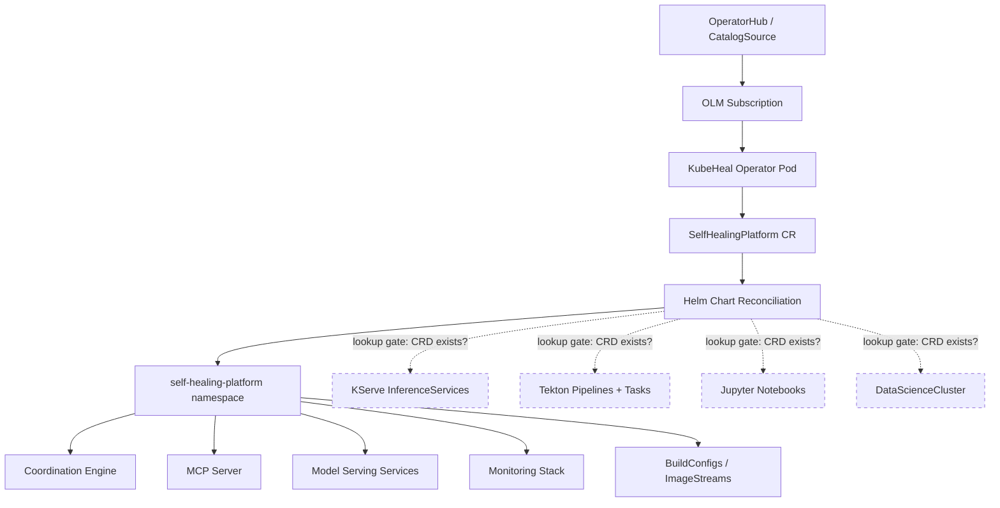

# Runbook: Install the KubeHeal Operator on OpenShift

**Owner**: KubeHeal Community
**Risk Level**: Low
**Last Updated**: 2026-10-02
**Last Tested**: 2026-10-02 (ROSA OCP 4.22.15)
**Version**: 1.0.0

---

## Quick Reference

| Attribute | Value |
|-----------|-------|
| **Execution Time** | ~10 minutes (operator only), ~25 minutes (with prerequisites) |
| **Impact Window** | No downtime. New namespace only. |
| **Rollback Time** | ~3 minutes |
| **Prerequisites** | OpenShift 4.20+, `oc` CLI, cluster-admin |

---

## Scope and Use Case

### When to Use This Runbook

Use this runbook to install the KubeHeal AIOps Self-Healing Platform operator
from the OLM catalog on an OpenShift cluster and deploy a working
`SelfHealingPlatform` custom resource.

**Example Triggers**:
- First-time installation of KubeHeal on a new cluster
- Reinstallation after cleanup or upgrade
- Validation of operator functionality on a test cluster

### Expected Outcome

After completion:
- The KubeHeal operator runs in the `kubeheal-system` namespace.
- A `SelfHealingPlatform` CR deploys platform resources into `self-healing-platform`.
- Coordination Engine, MCP Server, model serving services, and monitoring are active.

### What This Does NOT Cover

- Installation of prerequisite operators (RHOAI, Tekton, ODF). See the prerequisite section.
- Model training or data pipeline execution.
- Production hardening (TLS, IRSA, network policies).

---

## Prerequisites

### Required Access and Permissions

- [ ] `cluster-admin` role on the target OpenShift cluster
- [ ] Write access to `openshift-marketplace` namespace (for CatalogSource)
- [ ] Network access from cluster to `quay.io` (to pull operator images)

### Required Tools

- [ ] `oc` CLI 4.20 or later
- [ ] `kubectl` 1.28 or later (optional, `oc` works as a substitute)

**Verify tool installation**:

```bash
oc version --client
```

### Prerequisite Operators

The KubeHeal Helm chart creates resources from several operator CRDs.
The chart uses Helm `lookup` gates, so missing operators do not block installation.
Install the prerequisites to enable the full feature set.

| Operator | Required | How to Install | Enables |
|----------|----------|----------------|---------|
| **Red Hat OpenShift AI (RHOAI)** | Recommended | OperatorHub: "Red Hat OpenShift AI" | KServe model serving, Jupyter workbenches, DataScienceCluster |
| **OpenShift Pipelines (Tekton)** | Recommended | OperatorHub: "Red Hat OpenShift Pipelines" | Training pipelines, deployment validation |
| **NVIDIA GPU Operator** | Optional | OperatorHub: "NVIDIA GPU Operator" | GPU-accelerated model training |
| **OpenShift Data Foundation** | Conditional | OperatorHub: "OpenShift Data Foundation" | Required only when `objectStore.backend: "noobaa"` |

> **Note**: External Secrets Operator and Jupyter Notebook Validator Operator are
> installed automatically by the chart through OLM Subscriptions.

### Decide Your Storage Backend

| Your Cluster | Set `objectStore.backend` to | Notes |
|--------------|------------------------------|-------|
| ROSA or AWS IPI | `"aws-s3"` (default) | Native S3. No ODF needed. |
| Baremetal or air-gapped | `"noobaa"` | Install ODF first. |
| Baremetal with external MinIO or Ceph S3 | `"aws-s3"` | Set `objectStore.aws.endpoint` to your S3 URL. |
| SNO (Single Node OpenShift) | `"noobaa"` or `"aws-s3"` | MCG-only ODF for NooBaa; native S3 for ROSA SNO. |

---

## Pre-Flight Checks

**STOP**: Do NOT proceed unless ALL checks pass.

### Check 1: Verify Cluster Access

```bash
oc whoami
oc get nodes
```

Pass criteria: Command returns your username and lists cluster nodes.

If this fails: Run `oc login <cluster-api-url>` with valid credentials.

---

### Check 2: Verify OpenShift Version

```bash
oc version
```

Pass criteria: Server version is 4.20, 4.21, or 4.22.

If this fails: The operator is tested on 4.20 through 4.22. Other versions may work but are not validated.

---

### Check 3: Verify No Conflicting Installation

```bash
oc get csv -A | grep kubeheal
oc get crd selfhealingplatforms.aiops.kubeheal.io
```

Pass criteria: No output (clean cluster).

If this fails: Run the [Rollback Procedure](#rollback-procedure) first to remove the
previous installation.

---

### Check 4: Verify Quay.io Image Access

```bash
oc run test-pull --image=quay.io/takinosh/kubeheal-operator:v0.1.7 \
  --restart=Never --command -- sleep 1 2>&1
oc delete pod test-pull --ignore-not-found
```

Pass criteria: Pod is created (even if it exits quickly).

If this fails: Check cluster proxy settings or image pull secrets for `quay.io`.

---

## Step-by-Step Procedure

### Step 1: Create the Operator Namespace

Create the namespace where the operator controller runs.

```bash
oc create namespace kubeheal-system
```

**Expected output**:

```
namespace/kubeheal-system created
```

---

### Step 2: Create the CatalogSource

Register the KubeHeal operator catalog with OLM.

```bash
cat <<'EOF' | oc apply -f -
apiVersion: operators.coreos.com/v1alpha1
kind: CatalogSource
metadata:
  name: kubeheal-operator-catalog
  namespace: openshift-marketplace
spec:
  sourceType: grpc
  image: quay.io/takinosh/kubeheal-operator-catalog:v0.1.7
  displayName: KubeHeal Operator
  publisher: KubeHeal Community
  updateStrategy:
    registryPoll:
      interval: 30m
EOF
```

**Expected output**:

```
catalogsource.operators.coreos.com/kubeheal-operator-catalog created
```

**Verification**: Wait for the catalog pod to become ready.

```bash
oc get catalogsource kubeheal-operator-catalog -n openshift-marketplace \
  -o jsonpath='{.status.connectionState.lastObservedState}'
```

Pass criteria: Output is `READY`. Allow up to 60 seconds.

If this fails: Check the catalog pod logs.

```bash
oc logs -n openshift-marketplace -l olm.catalogSource=kubeheal-operator-catalog
```

---

### Step 3: Create the OperatorGroup and Subscription

Install the operator through OLM.

```bash
cat <<'EOF' | oc apply -f -
---
apiVersion: operators.coreos.com/v1
kind: OperatorGroup
metadata:
  name: kubeheal-operator-group
  namespace: kubeheal-system
spec:
  targetNamespaces:
  - kubeheal-system
---
apiVersion: operators.coreos.com/v1alpha1
kind: Subscription
metadata:
  name: kubeheal-operator
  namespace: kubeheal-system
spec:
  channel: alpha
  name: kubeheal-operator
  source: kubeheal-operator-catalog
  sourceNamespace: openshift-marketplace
  installPlanApproval: Automatic
EOF
```

**Expected output**:

```
operatorgroup.operators.coreos.com/kubeheal-operator-group created
subscription.operators.coreos.com/kubeheal-operator created
```

**Verification**: Wait for the CSV to reach `Succeeded` phase.

```bash
oc get csv -n kubeheal-system --watch
```

Pass criteria: `kubeheal-operator.v0.1.7` shows `Succeeded` within 120 seconds.

**Verify the operator pod is running**:

```bash
oc get pods -n kubeheal-system
```

Pass criteria: One pod with `STATUS=Running` and `READY=1/1`.

If this fails: Check the operator pod logs.

```bash
oc logs -n kubeheal-system deployment/kubeheal-operator-controller-manager --tail=50
```

---

### Step 4: Choose and Apply a SelfHealingPlatform CR

Select the CR that matches your cluster platform. Three sample CRs are provided in
the operator repository under `config/samples/`.

**Option A: ROSA or AWS HA (default)**

```bash
cat <<'EOF' | oc apply -f -
apiVersion: aiops.kubeheal.io/v1alpha1
kind: SelfHealingPlatform
metadata:
  name: kubeheal
  namespace: kubeheal-system
spec:
  cluster:
    topology: "ha"
  nodeConfig:
    gpu:
      enabled: true
  consolePlugins:
    enabled: false
  objectStore:
    enabled: true
    backend: "aws-s3"
    aws:
      region: "us-east-1"
      bucketName: "your-model-storage-bucket"
  modelServing:
    enabled: true
    models:
      - name: anomaly-detector
        framework: sklearn
        runtime: kserve-sklearnserver
  monitoring:
    enabled: true
EOF
```

**Option B: Baremetal with ODF (NooBaa)**

```bash
cat <<'EOF' | oc apply -f -
apiVersion: aiops.kubeheal.io/v1alpha1
kind: SelfHealingPlatform
metadata:
  name: kubeheal
  namespace: kubeheal-system
spec:
  cluster:
    topology: "ha"
  consolePlugins:
    enabled: false
  objectStore:
    enabled: true
    backend: "noobaa"
  modelServing:
    enabled: true
  monitoring:
    enabled: true
EOF
```

**Option C: Single Node OpenShift**

```bash
cat <<'EOF' | oc apply -f -
apiVersion: aiops.kubeheal.io/v1alpha1
kind: SelfHealingPlatform
metadata:
  name: kubeheal
  namespace: kubeheal-system
spec:
  cluster:
    topology: "sno"
  consolePlugins:
    enabled: false
  objectStore:
    enabled: true
    backend: "aws-s3"
  modelServing:
    enabled: true
  monitoring:
    enabled: true
EOF
```

**Verification**: Check the CR status.

```bash
oc get selfhealingplatform -n kubeheal-system \
  -o jsonpath='{range .items[*]}{.metadata.name}: {range .status.conditions[*]}{.type}={.status} {end}{"\n"}{end}'
```

Pass criteria: Output shows `Initialized=True Deployed=True`.

If this fails: Check the operator logs for Helm render errors.

```bash
oc logs -n kubeheal-system deployment/kubeheal-operator-controller-manager --tail=30
```

---

### Step 5: Verify Deployed Resources

Confirm that platform resources were created in the `self-healing-platform` namespace.

```bash
echo "--- Pods ---"
oc get pods -n self-healing-platform

echo "--- Services ---"
oc get svc -n self-healing-platform

echo "--- ConfigMaps ---"
oc get configmap -n self-healing-platform | grep -v openshift-service-ca

echo "--- Secrets ---"
oc get secrets -n self-healing-platform | grep -E "model-storage|storage-config"

echo "--- BuildConfigs ---"
oc get bc -n self-healing-platform

echo "--- ImageStreams ---"
oc get is -n self-healing-platform
```

**Expected resources** (on a clean cluster without RHOAI or Tekton):

| Resource Type | Expected Count | Examples |
|---------------|----------------|----------|
| Services | 3 | `anomaly-detector-stable`, `predictive-analytics-stable`, `model-serving-metrics` |
| ConfigMaps | 5+ | `platform-config`, `notebook-env-setup`, `notebook-s3-config` |
| Secrets | 2+ | `model-storage-config`, `storage-config` |
| BuildConfigs | 1 | `sklearn-xgboost-server` |
| ImageStreams | 2 | `notebook-validator`, `sklearn-xgboost-server` |

> **Note**: Resources that depend on missing operator CRDs (KServe InferenceServices,
> Tekton Pipelines, Notebooks) are skipped automatically. Install the prerequisite
> operators and the chart reconciles them on the next cycle (within 60 seconds).

---

### Step 6: Install Prerequisite Operators (Optional)

Install prerequisite operators to enable the full feature set. The KubeHeal operator
reconciles every 60 seconds. New resources appear automatically after CRDs become
available.

**Red Hat OpenShift AI**:

```bash
cat <<'EOF' | oc apply -f -
apiVersion: operators.coreos.com/v1alpha1
kind: Subscription
metadata:
  name: rhods-operator
  namespace: redhat-ods-operator
spec:
  channel: stable
  name: rhods-operator
  source: redhat-operators
  sourceNamespace: openshift-marketplace
EOF
```

**Red Hat OpenShift Pipelines**:

```bash
cat <<'EOF' | oc apply -f -
apiVersion: operators.coreos.com/v1alpha1
kind: Subscription
metadata:
  name: openshift-pipelines-operator
  namespace: openshift-operators
spec:
  channel: latest
  name: openshift-pipelines-operator-rh
  source: redhat-operators
  sourceNamespace: openshift-marketplace
EOF
```

After each operator installs, watch the KubeHeal operator reconcile new resources:

```bash
oc logs -n kubeheal-system deployment/kubeheal-operator-controller-manager -f --tail=5
```

Look for `Upgraded release` log entries. Each entry means the Helm chart re-rendered
with newly available CRDs.

---

## Verification and Success Criteria

### Post-Execution Checks

#### Check 1: Operator Health

```bash
oc get csv -n kubeheal-system
oc get pods -n kubeheal-system
```

**Success criteria**:
- CSV phase is `Succeeded`.
- Operator pod is `Running` with 0 restarts.

---

#### Check 2: CR Reconciliation

```bash
oc get selfhealingplatform -n kubeheal-system \
  -o jsonpath='{range .items[*]}{.metadata.name}: {range .status.conditions[*]}{.type}={.status} {end}{"\n"}{end}'
```

**Success criteria**: `Deployed=True`.

---

#### Check 3: Platform Namespace Active

```bash
oc get ns self-healing-platform
oc get all -n self-healing-platform
```

**Success criteria**: Namespace exists and contains services, pods, and/or builds.

---

#### Check 4: No Error Loops in Operator Logs

```bash
oc logs -n kubeheal-system deployment/kubeheal-operator-controller-manager --tail=20 \
  | grep -c '"level":"error"'
```

**Success criteria**: Zero errors, or only transient errors that resolved on retry.

---

## Rollback Procedure

### When to Rollback

Execute rollback if ANY of these occur:
- The CR status shows a persistent error that does not resolve after 5 minutes.
- The operator pod is in `CrashLoopBackOff`.
- You need to remove the operator to start over.

### Rollback Steps

#### Step 1: Delete the CR

```bash
oc delete selfhealingplatform --all -n kubeheal-system
```

Wait for the `self-healing-platform` namespace resources to terminate:

```bash
oc get all -n self-healing-platform
```

---

#### Step 2: Uninstall the Operator

```bash
oc delete subscription kubeheal-operator -n kubeheal-system
oc delete csv -n kubeheal-system --all
oc delete operatorgroup kubeheal-operator-group -n kubeheal-system
```

---

#### Step 3: Remove the CatalogSource

```bash
oc delete catalogsource kubeheal-operator-catalog -n openshift-marketplace
```

---

#### Step 4: Delete Namespaces

```bash
oc delete namespace kubeheal-system --ignore-not-found
oc delete namespace self-healing-platform --ignore-not-found
```

---

#### Step 5: Remove Cluster-Scoped Resources

```bash
oc delete crd selfhealingplatforms.aiops.kubeheal.io --ignore-not-found
oc delete clusterrole -l olm.owner.namespace=kubeheal-system
oc delete clusterrolebinding -l olm.owner.namespace=kubeheal-system
```

---

#### Step 6: Verify Clean State

```bash
oc get all -n kubeheal-system 2>&1
oc get crd | grep kubeheal
```

Pass criteria: "No resources found" and no CRDs listed.

---

## Troubleshooting

### Issue 1: CatalogSource Stuck in TRANSIENT_FAILURE

**Symptoms**: `oc get catalogsource` shows `TRANSIENT_FAILURE` for more than 2 minutes.

**Diagnosis**:

```bash
oc get pods -n openshift-marketplace | grep kubeheal
oc logs -n openshift-marketplace -l olm.catalogSource=kubeheal-operator-catalog
```

**Root Cause**: The cluster cannot pull the catalog image from `quay.io`.

**Solution**: Verify network access to `quay.io`. Check for image pull secrets or proxy configuration.

```bash
oc get proxy/cluster -o jsonpath='{.spec.httpProxy}'
```

---

### Issue 2: CR Shows "resource mapping not found"

**Symptoms**: The CR condition message lists CRDs that are not installed.

**Root Cause**: This occurred in operator versions before v0.1.7. Earlier versions did not
have Helm `lookup` gates for all CRD types.

**Solution**: Verify you are running v0.1.7 or later.

```bash
oc get csv -n kubeheal-system -o jsonpath='{.items[0].spec.version}'
```

If the version is older, update the CatalogSource image tag and recreate the subscription.

---

### Issue 3: Operator Pod OOMKilled

**Symptoms**: Pod restarts with reason `OOMKilled`.

**Root Cause**: This occurred in operator versions before v0.1.2. The memory limit was
128Mi, which is too small for the 1000+ line Helm chart.

**Solution**: Version v0.1.7 sets memory limits to 512Mi. Upgrade to the latest version.

---

### Issue 4: Helm Chart Resources Not Appearing After Operator Install

**Symptoms**: The operator installed and the CR shows `Deployed=True`, but expected
resources (InferenceServices, Pipelines, Notebooks) do not exist.

**Root Cause**: The prerequisite operator CRDs are not installed. The Helm chart
gates these resources with `lookup` and skips them when CRDs are absent.

**Solution**: Install the prerequisite operators (see Step 6). The chart reconciles
every 60 seconds and creates the resources automatically.

---

### Escalation Path

| Severity | First Contact | Response Time |
|----------|---------------|---------------|
| **P1 (Operator crash)** | [GitHub Issue](https://github.com/KubeHeal/kubeheal-operator/issues) | Best effort (community) |
| **P2 (Feature not working)** | [GitHub Issue](https://github.com/KubeHeal/kubeheal-operator/issues) | Best effort (community) |
| **P3 (Question)** | [GitHub Discussions](https://github.com/KubeHeal/kubeheal-operator/discussions) | Best effort (community) |

---

## Post-Execution Tasks

### Immediate (Within 5 Minutes)

- [ ] Verify CR status shows `Deployed=True`.
- [ ] Confirm platform namespace has expected resources.
- [ ] Check operator logs for errors.

### Within 24 Hours

- [ ] Install prerequisite operators (RHOAI, Tekton) if not already present.
- [ ] Verify that prerequisite-dependent resources appear after operator installation.
- [ ] Run a model training pipeline (if Tekton is installed).

### Within 1 Week

- [ ] Configure S3 credentials for model storage.
- [ ] Deploy and test an ML model through KServe.
- [ ] Review monitoring dashboards.

---

## Appendix

### Architecture



Dashed resources render only when the prerequisite operator CRDs are present on the cluster.

### CRD Lookup Gates (18 Types)

The Helm chart gates resources on CRD existence. This table shows every gated type
and the operator that provides it.

| CRD | Operator | Template |
|-----|----------|----------|
| `notebookvalidationjobs.mlops.mlops.dev` | Jupyter Notebook Validator | `notebook-validation-jobs.yaml` |
| `pipelines.tekton.dev` | OpenShift Pipelines | `tekton-*.yaml` |
| `inferenceservices.serving.kserve.io` | RHOAI (KServe) | `model-serving.yaml` |
| `servingruntimes.serving.kserve.io` | RHOAI (KServe) | `kserve-runtimes.yaml` |
| `notebooks.kubeflow.org` | RHOAI | `ai-ml-workbench.yaml` |
| `datascienceclusters.datasciencecluster.opendatahub.io` | RHOAI | `datasciencecluster.yaml` |
| `clusterpolicies.nvidia.com` | NVIDIA GPU Operator | `nvidia-gpu-operator.yaml` |
| `nodefeaturediscoveries.nfd.openshift.io` | NFD Operator | `nvidia-gpu-operator.yaml` |
| `externalsecrets.external-secrets.io` | External Secrets Operator | `externalsecrets.yaml` |
| `secretstores.external-secrets.io` | External Secrets Operator | `secretstore.yaml` |
| `clustersecretstores.external-secrets.io` | External Secrets Operator | `clustersecretstore.yaml` |
| `externalsecretsconfigs.operator.openshift.io` | External Secrets (OCP) | `externalsecretsconfig.yaml` |
| `issuers.cert-manager.io` | cert-manager | `jupyter-notebook-validator-operator.yaml` |
| `certificates.cert-manager.io` | cert-manager | `jupyter-notebook-validator-operator.yaml` |
| `bucketclasses.noobaa.io` | ODF (NooBaa) | `noobaa-bucket-class.yaml` |
| `objectbucketclaims.objectbucket.io` | ODF (NooBaa) | `object-bucket-claim.yaml` |
| `servicemonitors.monitoring.coreos.com` | Prometheus Operator | `monitoring.yaml` |
| `prometheusrules.monitoring.coreos.com` | Prometheus Operator | `prometheusrule.yaml` |

### Sample CRs

| Platform | File |
|----------|------|
| ROSA / AWS HA | [`config/samples/aiops_v1alpha1_selfhealingplatform.yaml`](https://github.com/KubeHeal/kubeheal-operator/blob/main/config/samples/aiops_v1alpha1_selfhealingplatform.yaml) |
| SNO | [`config/samples/aiops_v1alpha1_selfhealingplatform_sno.yaml`](https://github.com/KubeHeal/kubeheal-operator/blob/main/config/samples/aiops_v1alpha1_selfhealingplatform_sno.yaml) |
| Baremetal | [`config/samples/aiops_v1alpha1_selfhealingplatform_baremetal.yaml`](https://github.com/KubeHeal/kubeheal-operator/blob/main/config/samples/aiops_v1alpha1_selfhealingplatform_baremetal.yaml) |

### Related Documentation

- [KubeHeal Operator Repository](https://github.com/KubeHeal/kubeheal-operator)
- [OpenShift AIOps Platform Repository](https://github.com/KubeHeal/openshift-aiops-platform)
- [ADR-065: Baremetal Compatibility](https://github.com/KubeHeal/openshift-aiops-platform/blob/main/docs/adrs/065-baremetal-agent-based-install-compatibility.md)

### Version History

| Version | Date | Author | Changes |
|---------|------|--------|---------|
| 1.0.0 | 2026-10-02 | KubeHeal | Initial version. Tested on ROSA OCP 4.22.15 with v0.1.7. |

---

**Last Reviewed**: 2026-10-02
**Next Review**: 2027-01-02
**Feedback**: [Open an issue](https://github.com/KubeHeal/kubeheal-operator/issues)
